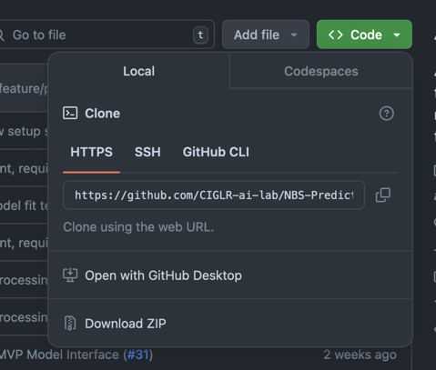

# NBS-Predictor-MVP

Welcome to the NBS Predictor MVP project! We're excited to work towards a minimum viable product (MVP) designed to
forecast net basin supply (NBS) six months into the future using NOAA forecast data.

- **Target**: Forecast monthly net basin supply (NBS) for all of the Great Lakes, for six months into the future
- **Inputs**: NOAA forecast data (e.g., Climate Forecast System, National Water Model)

Our project will evolve over time, adjusting its targets and inputs as needed. This repository represents our initial
effort to tackle this prediciton task.

## Getting Started

### Prerequisites

Before diving in, make sure you have the following installed on your system:

- **Python 3.8** or later
- **pip**
- **virtualenv**

### Clone the Repository

Begin by cloning the repository to your local machine and navigate into the project directory:

```bash
git clone https://github.com/CIGLR-ai-lab/NBS-Predictor-MVP.git
cd NBS-Predictor-MVP
```

### Create a Virtual Environment

Create a virtual environment within the project directory to isolate the project's dependencies:

For Unix-like systems and Windows:

```
virtualenv env
```

Or if you prefer to use 'venv' which is included in Python 3.3 and later:

```
python3 -m venv env  # For Unix-like systems
python -m venv env   # For Windows
```

### Activate the Virtual Environment

Activate your virtual environment accordingly:

- **Linux/Mac:**

  ```bash
  source ./env/bin/activate
  ```

- **Windows:**

  ```bash
  .\env\Scripts\activate
  ```

### Install Required Packages

Install the necessary packages using `pip`:

```bash
pip install -r requirements/requirements.txt
```

There are alternative packages for development, as some packages will not be needed at runtime:

```bash
pip install -r requirements/dev-requirements.txt
```

And there are alternative packages for testing as well:

```bash
pip install -r requirements/test-requirements.txt
```

### Deactivate the Virtual Environment

When you have finished working with the project, or if you need to return to your global Python environment, you can
deactivate the virtual environment by running the following command:

```bash
deactivate
```

### Build Instructions (Optional, UNDER DEVELOPMENT)

We provide a Makefile to streamline the project's development workflow, which is optional. You can use the Makefile to
simplify the setup process and automate routine tasks. If you prefer using the Makefile, follow these steps:

1. **Run Makefile Command**

   Run the `create_environment` target to set up the virtual environment:

   ```bash
   make create_environment
   ```

2. **Install Required Packages**

   Install the required packages using `pip`:

   ```bash
    pip install -r requirements/requirements.txt
   ```

3. **Activate the Virtual Environment**

   Activate the virtual environment as described in the "Activate the Virtual Environment" section above.

4. **Run the Project**

   Run the project using the appropriate command for your project:

   ```bash
   python your_script.py
   ```

For more details about the available Makefile commands and how to use them, check out
the [Makefile Documentation](docs/MAKEFILE.md).

## Project Organization

```
├── LICENSE
|
├── docs/
│   ├── MAKEFILE.md               # Detailed Makefile documentation
│   └── ...                       # Other documentation files
|
├── Makefile           <- Makefile with commands like `make init` or `make lint-requirements` (Optional)
|
├── README.md          <- The top-level README for developers using this project.
|
├── notebooks          <- Jupyter notebooks. Naming convention is a number (for ordering),
|   |                     the creator's initials, and a short `-` delimited description, e.g.
|   |                     `1.0_initial-data-exploration`.
|   |  
│   ├── exploratory    <- Notebooks for initial exploration.
|   |  
│   └── reports        <- Polished notebooks for presentations or intermediate results.
│
├── report             <- Generated analysis as HTML, PDF, LaTeX, etc.
|   |  
│   ├── figures        <- Generated graphics and figures to be used in reporting
|   |  
│   └── sections       <- LaTeX sections. The report folder can be linked to your overleaf
|                         report with github submodules.
│
├── requirements       <- Directory containing the requirement files.
│
├── setup.py           <- makes project pip installable (pip install -e .) so src can be imported
│
├── src                <- Source code for use in this project.
│   │
│   ├── __init__.py    <- Makes src a Python module
│   │
│   ├── data_loading   <- Scripts to download or generate data
│   │
│   ├── preprocessing  <- Scripts to turn raw data into clean data and features for modeling
|   |
│   ├── models         <- Scripts to train models and then use trained models to make
│   │                     predictions
│   │
│   └── tests          <- Scripts for unit tests of your functions
│
└── setup.cfg          <- setup configuration file for linting rules
```

## Usage

To start, certain data assets are expected to be downloaded locally. These include
precipitation, evaporation, runoff, latent heat flux, and precipitation figures
from both CFSR and historical sources.

Note that the file names and folder structure must be match *exactly* for the data loading function
to work in `src/data_loading.py`.

```
├── data/
|   ├── CFSR/  <- Directory for CFSR (reanalysis data).
|   |   ├── CFSR_APCP_Basin_Avgs.csv
|   |   ├── CFSR_APCP_Basin_Sums.csv
|   |   ├── CFSR_EVAP_Basin_Avgs.csv
|   |   ├── CFSR_EVAP_Basin_Sums.csv
|   |   ├── CFSR_LHFX_Basin_Avgs.csv
|   |   ├── CFSR_LHFX_Basin_Sums.csv
|   |   ├── CFSR_TMP_Basin_Avgs.csv
|   ├── historical/
|   |   ├── evap_glerl_lakes_mic_hur_combined.csv
|   |   ├── pcp_glerl_lakes_mic_hur_combined.csv
|   |   ├── rnbs_glcc.csv
|   |   ├── runoff_glerl_mic_hur_combined.csv
|   |   ├── wl_glcc.csv

```

For example, this is a valid way to load data:

```python
from src.data_loading.data_loading import load_data

covariates = load_data(["evap_cfsr", "temp_hist"])
```

For a full listing of available data sets, see `src.step1_data_loading.data_loading.series_map`.

## Contributing

We welcome contributions to the NBS-Predictor-MVP! Whether it's improving the codebase, addressing issues, or enhancing
documentation, your help is invaluable.

To contribute:

1. **Clone the repository**: Click on the 'Code' button and follow instructions to clone the repository
   locally. 
2. **Create your feature branch**: From your local repo, checkout a new branch for your feature or fix.
3. **Commit your changes**: Make sure your commits are clear and understandable.
4. **Push to the branch**: Push your changes to GitHub.
5. **Create a new Pull Request**: Submit a pull request to our `main` branch with a clear list of what you've done.
   Please follow the pull request template provided.

Before submitting a pull request, please make sure to review the [contributing guidelines](CONTRIBUTING.md) for detailed
information on how to contribute.

Issues can be reported using the GitHub issue tracker. We ask that you please look for any related issues before
submitting a new one to avoid duplicates.

For significant changes, please start a thread in the Discussions tab to chat about what you would like to contribute
with the community.

New to Git/GitHub? Check out this resource from [Software Carpentry](https://swcarpentry.github.io/git-novice/)

## Code of Conduct

This project and everyone participating in it is governed by our Code of Conduct. By participating, you are expected to
uphold this code and behave appropriately and respectfully toward other contributors.

Please read the [code of conduct](CODE_OF_CONDUCT.md) file to learn more about our community standards.

## Roadmap

The roadmap for NBS-Predictor-MVP is a plan that guides the project's planned features and improvements. Our initial
focus is setting up the three primary modules for data acquisition, predictive modeling, and post-processing
visualization.

We are committed to iterative development, aiming to continuously deliver updates that improve reliability, accuracy,
and usability. As part of the roadmap, we welcome community feedback to help shape the direction of the project.

Here are our primary milestones for the MVP:

1. **Data Acquisition Module**: Develop the data downloading and formatting module leveraging NOAA's data sources.
2. **Predictive Modeling**: Implement and validate the first prediction models focusing on accuracy and reliability.
3. **Post-Processing Visualisation and Reporting**: Set up the module for data visualization, reporting, and
   interpreting model forecasts.

Future enhancements post-MVP:

- Harnessing more diverse data sources to (hopefully) improve the model's predictive power.
- Expand our approach to deliver ensemble forecasts.
- Expanding the visualization tools to allow more extensive data analysis.

Please see the [roadmap](ROADMAP.md) for the most up-to-date information on upcoming features and project direction.
